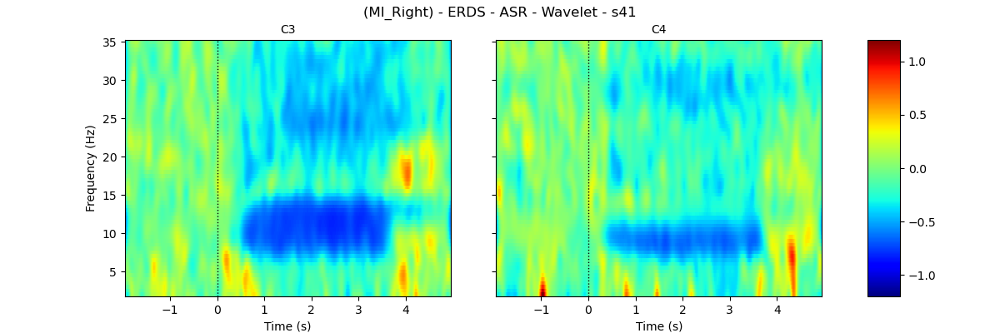
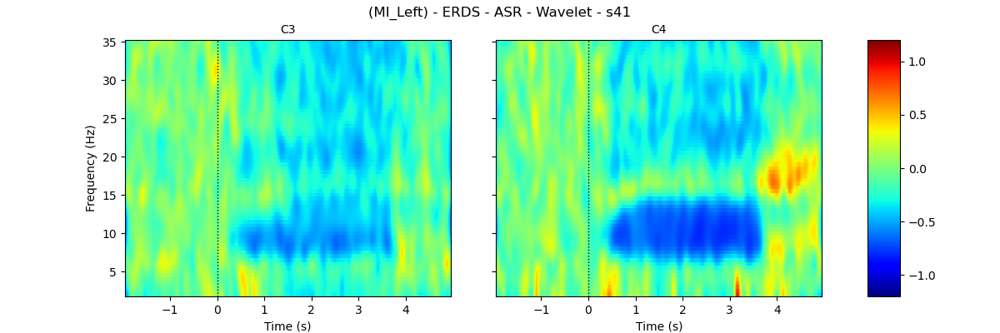
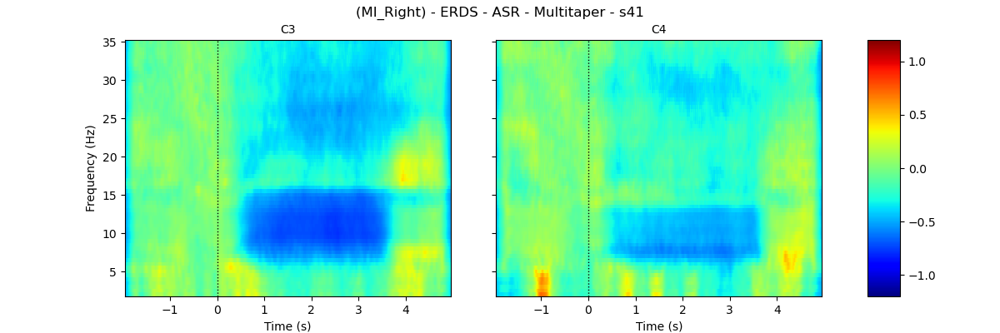
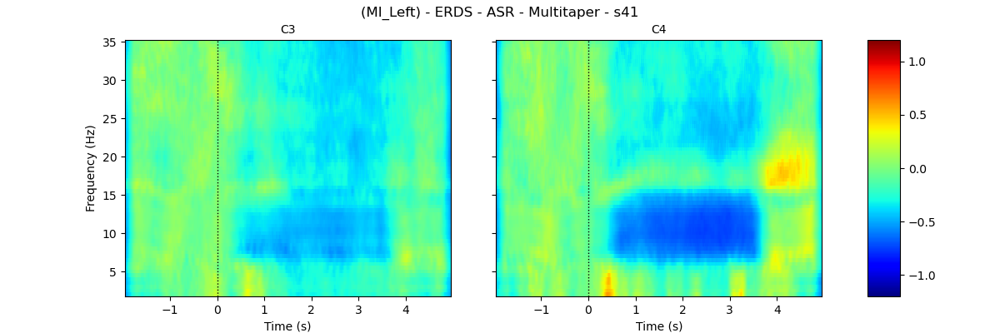
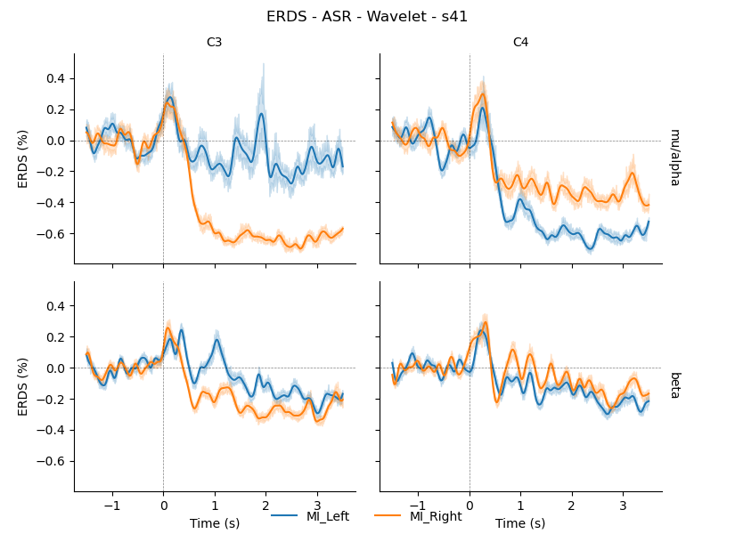
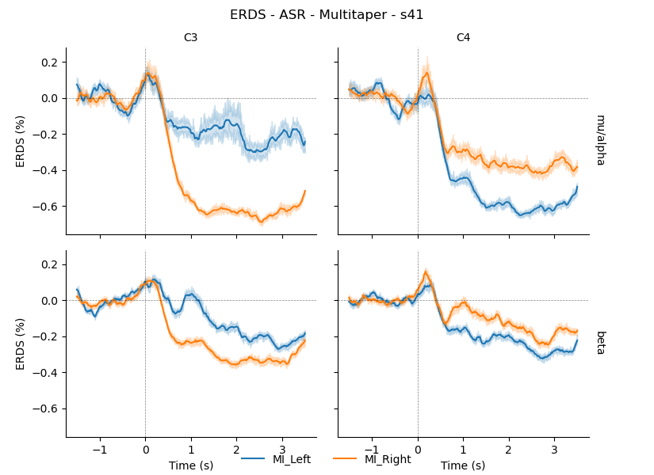

This repository is an example of creating individual event-related des/synchronization ERDS maps and plots for EEG Motor Imagery data

The repository contains code and instructions to read the ["EEG datasets for motor imagery brain-computer interface"](https://doi.org/10.1093/gigascience/gix034) which is in .mat format and transforms it to MNE-python classes. Also demonstrates how to apply Artifact Subspace Reconstruction (ASR) to clean the data. Contains code to create epochs and finally, it includes custom functions that uses MNE-python tfr (time-frequency) class to create ERDS maps and plots.

Example plots from analysis of subject 41 of the dataset

ERDS Map - Motor Imagery Rigth - s41 - ASR - Wavelet 

ERDS Map - Motor Imagery Left - s41 - ASR - Wavelet 

ERDS Map - Motor Imagery Rigth - s41 - ASR - Multitapers 

ERDS Map - Motor Imagery Left - s41 - ASR - Multitapers 

ERDS Plot - Motor Imagery - s41 - ASR - Wavelet 

ERDS Plot - Motor Imagery - s41 - ASR - Wavelet 

## Dataset

The ["EEG datasets for motor imagery brain-computer interface"](https://doi.org/10.1093/gigascience/gix034) includes a 64-channels EEG recordings from 52 subjects obtained during motor imagery and execution tasks.

An example of how to read from the dataset and convert to .fif files for MNE-python can be found in the notebook [read_raw_data]

## Artifact Subspace Reconstruction (ASR)

ASR is a technique used to remove artifacts from EEG data. This repository uses the ASR functions from .

An example of how to apply ASR to the dataset is presented in the notebook [ASR_processing]

## ERDS (Event-Related Desynchronization/Synchronization) Maps

ERDS maps are used to visualize changes in brain activity during specific events or tasks. They show the relative power of different frequency bands at different time points. ERDS maps are commonly used in brain-computer interface research to analyze motor imagery tasks.

To generate ERDS maps from the EEG data, follow these steps:

1. Preprocess the EEG data and create epochs. In this case, epochs are created from the ASR pre-processed data. Check the notebook [epochs_ASR] on epoching.
2. Compute the power spectrum for of the epochs and create a tfr (time-frequency) MNE-python object. Check the notebook [ERDS_plots].
3. Calculate the ERDS values by comparing the power spectrum to a baseline period and average across epochs. Check the notebook [ERDS_plots].
4. Visualize the ERDS maps and plot using the custom functions in [utils/utils.py]. Check the notebook [ERDS_plots].

## Usage

1. Download the "EEG datasets for motor imagery brain-computer interface" dataset from [https://doi.org/10.1093/gigascience/gix034].
2. Run the provided scripts or modify them according to your needs.

## Credits

The subsequent repositories/data were utilized, either closely adhering to their original form or serving as a source of inspiration:

- EEG datasets for motor imagery brain-computer interface [https://doi.org/10.1093/gigascience/gix034]
- ASR repository [https://github.com/DiGyt/asrpy]
- MNE-python [https://mne.tools/stable/index.html]. Tutorial [https://mne.tools/stable/auto_examples/time_frequency/time_frequency_erds.html]

